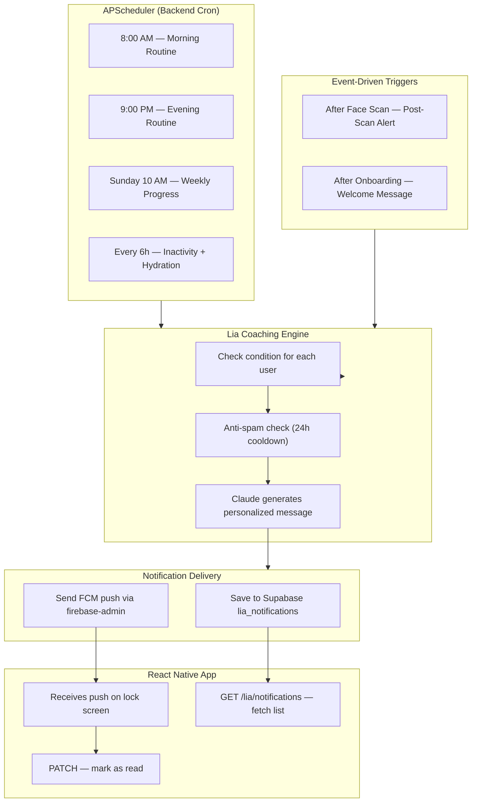

# Lia — Personalized AI Coach + Notifications + FCM Push

Rebrand GIXY → **Lia** and add a **backend-controlled cron scheduler** that proactively generates personalized, data-driven coaching notifications and delivers them as **real push notifications** via Firebase Cloud Messaging (FCM).

## Current State

- Existing `chat.py` (GIXY) has full user context fetching — profile, scans, routines, memories, subscription, profile score
- Chat router is **commented out** in `main.py`
- **No scheduler, no notification system, no FCM** exists yet
- Face scans store `detected_condition` with severities (Mild/Moderate/Severe), `overall_score`, `hydration` in MongoDB `face_scans` collection
- Saved routines are in Supabase `saved_routines` table

---

## Prerequisites (User Action Required)

> [!IMPORTANT]
> **Before I start building, you need to set up Firebase:**
> 1. Go to [Firebase Console](https://console.firebase.google.com/)
> 2. Create a project (or use existing one)
> 3. Go to **Project Settings → Service Accounts → Generate New Private Key**
> 4. Download the JSON file → save it as `firebase-service-account.json` in the project root
> 5. Add to `.env`: `FIREBASE_SERVICE_ACCOUNT_PATH=firebase-service-account.json`
> 6. In your React Native app, install `@react-native-firebase/app` + `@react-native-firebase/messaging`

> [!WARNING]
> **APScheduler** runs inside the same FastAPI process. Works perfectly for single-server deployment. For multi-instance scaling later, migrate to external cron (Railway/Render cron jobs).

---

## Architecture Overview



---

## Proposed Changes

---

### 1. Supabase Table — `lia_notifications`

Run this SQL in Supabase SQL Editor:

```sql
CREATE TABLE lia_notifications (
    id          uuid DEFAULT gen_random_uuid() PRIMARY KEY,
    user_id     text NOT NULL,
    trigger     text NOT NULL,
    title       text NOT NULL,
    message     text NOT NULL,
    data        jsonb DEFAULT '{}',
    is_read     boolean DEFAULT false,
    created_at  timestamptz DEFAULT now()
);

CREATE INDEX idx_lia_notif_user ON lia_notifications(user_id);
CREATE INDEX idx_lia_notif_user_unread ON lia_notifications(user_id, is_read);
CREATE INDEX idx_lia_notif_user_trigger ON lia_notifications(user_id, trigger, created_at DESC);
```

---

### 2. Firebase Push Service — New File

#### [NEW] [firebase_push.py](file:///c:/Users/mdsad/Documents/lina_bht_backend/app/services/firebase_push.py)

Initializes `firebase-admin` SDK and provides a `send_push` function:

```python
# Initialization:
# - Reads FIREBASE_SERVICE_ACCOUNT_PATH from .env
# - Initializes firebase_admin.App once at import time
# - Gracefully degrades if not configured (logs warning, skips push)

def send_push(fcm_token: str, title: str, body: str, data: dict = None) -> bool:
    """Send a push notification to a single device. Returns True on success."""

def send_push_batch(tokens: list[str], title: str, body: str, data: dict = None) -> int:
    """Send to multiple devices. Returns count of successful deliveries."""
```

Uses `firebase_admin.messaging.send()` — handles token expiry gracefully (removes stale tokens from MongoDB).

---

### 3. FCM Token Storage — Modify Auth

#### [MODIFY] [auth.py](file:///c:/Users/mdsad/Documents/lina_bht_backend/app/routers/auth.py)

Add new endpoint to save/update FCM token:

```python
class FCMTokenRequest(BaseModel):
    fcm_token: str
    device_id: str = None  # optional — identifies the device

@router.post("/fcm-token")
async def save_fcm_token(body: FCMTokenRequest, current_user: CurrentUser):
    """Save or update FCM token for push notifications."""
    # Stores in user document: { "fcm_tokens": ["token1", "token2"] }
    # Supports multiple devices per user
```

Also update `signin`, `google`, and `apple` endpoints to optionally accept `fcm_token` in the request body (the app sends it on login).

---

### 4. Notification Service — New File

#### [NEW] [lia_notification_service.py](file:///c:/Users/mdsad/Documents/lina_bht_backend/app/services/lia_notification_service.py)

CRUD operations for the `lia_notifications` Supabase table:

| Function | Purpose |
|---|---|
| `save_notification(user_id, trigger, title, message, data)` | Insert notification row |
| `get_user_notifications(user_id, limit, unread_only)` | Fetch notifications for a user |
| `get_unread_count(user_id)` | Count of unread notifications |
| `mark_read(notification_id, user_id)` | Mark one as read |
| `mark_all_read(user_id)` | Mark all as read |
| `has_recent_notification(user_id, trigger, hours)` | Anti-spam: check if trigger was sent recently |

---

### 5. Lia Coaching Engine — New File

#### [NEW] [lia_coaching_engine.py](file:///c:/Users/mdsad/Documents/lina_bht_backend/app/services/lia_coaching_engine.py)

The brain of the notification system. Contains trigger functions that:
1. Query user data from MongoDB/Supabase
2. Check if condition is met
3. Check anti-spam (skip if same trigger sent recently)
4. Call Claude to generate a personalized 1-2 sentence message
5. Save notification to Supabase
6. Send FCM push to user's device(s)

**Trigger functions:**

| Trigger | Condition | Cooldown | Example |
|---|---|---|---|
| `post_scan_alert` | Scan has Moderate/Severe condition | 12h | "Your scan detected moderate redness on your cheeks. A calming toner with niacinamide tonight can help soothe this." |
| `morning_routine` | User has morning routine steps | 24h | "Good morning! Your Vitamin C serum step is key — consistency is what fades those dark spots." |
| `evening_routine` | User has evening routine steps | 24h | "Evening reminder: your cleanser + retinol combo is working. Last scan showed texture improvement." |
| `weekly_progress` | 2+ scans to compare | 7 days | "Weekly update: your score improved from 62 to 71! Hydration up 15%. Keep going." |
| `inactivity_nudge` | No scan in 7+ days | 3 days | "It's been a week since your last scan. A quick check helps Lia track your progress." |
| `hydration_reminder` | Last scan hydration < 40 | 24h | "Your skin hydration was 35% last scan. Try 2L of water today and a hydrating serum tonight." |
| `streak_celebration` | Consistent routine 7+ days | 7 days | "7 days straight with your routine — amazing! Your skin is noticing the consistency." |
| `new_user_welcome` | Just completed onboarding | Once | "Welcome! I'm Lia, your skincare coach. Do a face scan and I'll build your perfect routine." |

**Claude prompt for message generation:**

```python
COACHING_SYSTEM = """
You are Lia, a warm and knowledgeable skincare coach.
Generate a SHORT push notification message (1-2 sentences max, under 150 characters for the title, under 300 characters for the body).
The message must be:
- Personalized to the user's actual data (reference specific conditions, scores, products)
- Motivational but NOT generic — no "You got this!" without context
- Educational — explain WHY something matters
- Never alarmist, always encouraging
- Never pushy about subscriptions or purchases
"""
```

---

### 6. Scheduler — New File

#### [NEW] [lia_scheduler.py](file:///c:/Users/mdsad/Documents/lina_bht_backend/app/services/lia_scheduler.py)

APScheduler `AsyncIOScheduler` with cron triggers:

```python
scheduler = AsyncIOScheduler()

# ── Cron Jobs ──────────────────────────────────────────
scheduler.add_job(run_morning_routine,    CronTrigger(hour=8,  minute=0))
scheduler.add_job(run_evening_routine,    CronTrigger(hour=21, minute=0))
scheduler.add_job(run_weekly_progress,    CronTrigger(day_of_week="sun", hour=10))
scheduler.add_job(run_periodic_checks,    IntervalTrigger(hours=6))
# ── Periodic checks include: inactivity_nudge, hydration_reminder, streak_celebration
```

Each job:
1. Fetches all active users from MongoDB
2. For each user, calls the corresponding trigger function
3. Runs with `asyncio.gather` for parallelism (batches of 10 users)
4. Logs results

---

### 7. Notification API Router — New File

#### [NEW] [lia.py](file:///c:/Users/mdsad/Documents/lina_bht_backend/app/routers/lia.py)

| Method | Path | Description |
|---|---|---|
| `GET` | `/lia/notifications` | Fetch notifications (`?limit=20&unread_only=true`) |
| `GET` | `/lia/notifications/unread-count` | Count of unread |
| `PATCH` | `/lia/notifications/{id}/read` | Mark one as read |
| `PATCH` | `/lia/notifications/read-all` | Mark all as read |
| `POST` | `/lia/coaching` | On-demand: generate a coaching message now |

---

### 8. Chat Router — Rebrand GIXY → Lia

#### [MODIFY] [chat.py](file:///c:/Users/mdsad/Documents/lina_bht_backend/app/routers/chat.py)

- Replace all "GIXY" → "Lia" (system prompt, comments, descriptions, memory summarizer)
- Update personality: warm, motivational, educational, data-driven coach
- Add **Layer 9 — Scan Progress** (compare last 2 scans for score delta, improved/worsened triggers)
- Update memory summarizer to reference "Lia"

---

### 9. Post-Scan Alert Hook

#### [MODIFY] [scan.py](file:///c:/Users/mdsad/Documents/lina_bht_backend/app/routers/scan.py)

After `save_scan_result()` (line 104), trigger Lia's post-scan alert:

```python
from app.services.lia_coaching_engine import trigger_post_scan_alert
import asyncio

# After save_scan_result (line 104):
asyncio.create_task(
    trigger_post_scan_alert(user_id, ai_data)
)
```

---

### 10. Main App Updates

#### [MODIFY] [main.py](file:///c:/Users/mdsad/Documents/lina_bht_backend/main.py)

```python
from app.routers import lia
from app.services.lia_scheduler import start_scheduler, stop_scheduler

@asynccontextmanager
async def lifespan(app: FastAPI):
    await create_indexes()
    start_scheduler()           # ← Start Lia's cron jobs
    print(f"🚀 SkinSense API ready.  LLM = {_llm_label()}")
    yield
    stop_scheduler()            # ← Clean shutdown
    print("🛑 Server shutdown.")

# Enable routers:
app.include_router(chat_router)   # uncomment existing line
app.include_router(lia.router)    # add new
```

#### [MODIFY] [requirements.txt](file:///c:/Users/mdsad/Documents/lina_bht_backend/requirements.txt)

```
apscheduler>=3.10.0
firebase-admin>=6.0.0
```

#### [MODIFY] [.env.example](file:///c:/Users/mdsad/Documents/lina_bht_backend/.env.example)

```
# ── Firebase (Push Notifications) ────────────────────
FIREBASE_SERVICE_ACCOUNT_PATH=firebase-service-account.json
```

---

## Complete File Summary

| File | Status | Purpose |
|---|---|---|
| `app/services/firebase_push.py` | **NEW** | FCM push via `firebase-admin` SDK |
| `app/services/lia_notification_service.py` | **NEW** | CRUD for `lia_notifications` Supabase table |
| `app/services/lia_coaching_engine.py` | **NEW** | 8 trigger functions + Claude message generation |
| `app/services/lia_scheduler.py` | **NEW** | APScheduler cron jobs |
| `app/routers/lia.py` | **NEW** | Notification API endpoints |
| `app/routers/chat.py` | MODIFY | Rebrand GIXY → Lia, add progress context |
| `app/routers/auth.py` | MODIFY | Add `POST /auth/fcm-token` + accept token on login |
| `app/routers/scan.py` | MODIFY | Hook post-scan alert trigger |
| `main.py` | MODIFY | Enable chat + lia routers, start/stop scheduler |
| `requirements.txt` | MODIFY | Add `apscheduler`, `firebase-admin` |
| `.env.example` | MODIFY | Add Firebase config |

---

## React Native Side (for your reference)

The mobile app needs:

```bash
npm install @react-native-firebase/app @react-native-firebase/messaging
```

```javascript
// On app launch (after login):
import messaging from '@react-native-firebase/messaging';

// 1. Request permission (iOS)
await messaging().requestPermission();

// 2. Get FCM token
const fcmToken = await messaging().getToken();

// 3. Send to backend
await api.post('/auth/fcm-token', { fcm_token: fcmToken });

// 4. Listen for foreground notifications
messaging().onMessage(async remoteMessage => {
    // Show in-app notification
});

// 5. Handle token refresh
messaging().onTokenRefresh(token => {
    api.post('/auth/fcm-token', { fcm_token: token });
});
```

---

## Verification Plan

### Automated Tests
1. Start dev server → verify scheduler starts with log: "Lia scheduler started"
2. `POST /auth/fcm-token` → verify token saved in user doc
3. `POST /lia/coaching` → verify personalized message returned
4. `GET /lia/notifications` → verify empty list for new user
5. Trigger a face scan with severe condition → verify notification created + FCM sent
6. `GET /lia/notifications/unread-count` → verify count = 1
7. `PATCH /lia/notifications/{id}/read` → verify marked as read
8. `POST /chat/message/sync` → verify Lia branding in response

### Manual Verification
- Check Supabase `lia_notifications` table for inserted rows
- Verify push notification arrives on physical device
- Verify anti-spam: same trigger doesn't fire twice in cooldown period
- Check scheduler logs in terminal for cron execution
